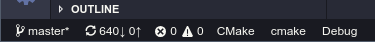

# Integration into VS Code
## Status Bar
After the successful configuration, there are three additional elements 
in the window's status bar.

The elements are (from left to right):
  1. Project
  2. Target
  3. Configuration

By clicking on one of those, a quick pick will open to select a new element.

